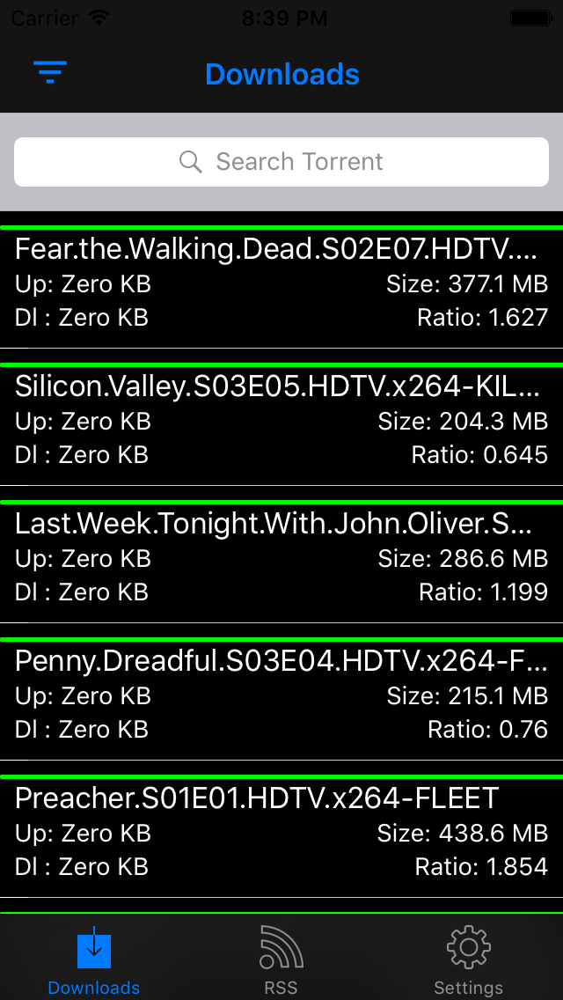

# roTorrent

A client for rTorrent on iPhone

Currently, you can:

- list all torrents
- filter them by state and order them by date, name, size
- search a particular torrent using its name
- display information on the torrent
- change the directory, start, pause, erase and delete files of the torrent
- add a torrent with a URL
- open a .torrent file from another app and start it
- manage RSS feed, add, remove or edit them
- display RSS items, and search a particular item using its name
- download a torrent from a RSS item
- set the host, username, password, and mount point for XMLRPC

Note: Due to new restrictions in iOS, you need to have access to your host through https.
